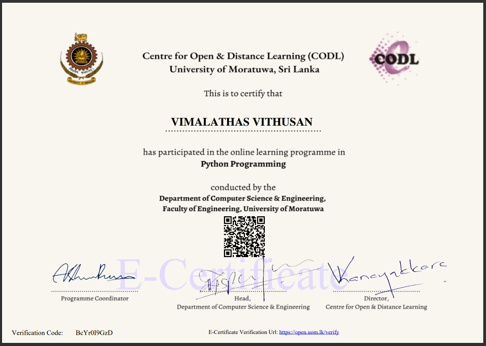

# Python-University-of-Moratuwa
## Open Learning Platform - UoM - Python Programming!
### 1. Python Data Structures
### 2. Object Oriented Programming
### 3. Working with Data
### 4. Programming for Computer Networks
### 5. Getting Started with Machine Learning
### 6. Version Control
### 7. Programming Assessment
### 8. Certificate

